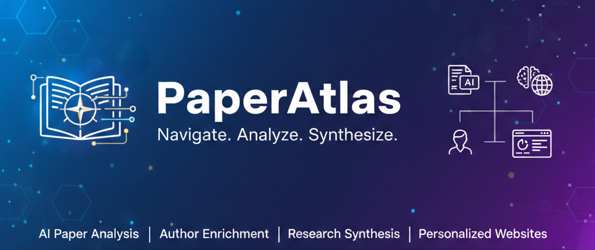

# PaperAtlas

A single-step web app to pull your Scholar Inbox conference, enrich authors and papers with LLMs, generate a synthesis, and ship a polished website.

## Quick Start (Web UI)

1) Clone and run:
```bash
git clone https://github.com/aldro61/PaperAtlas.git
cd PaperAtlas
chmod +x run.sh
OPENROUTER_API_KEY="your-key" ./run.sh
```
`run.sh` installs dependencies, ensures Playwright Chromium is installed, starts the server at http://localhost:5001, and opens it in your browser. If you ever see a Playwright error, run `python3 -m playwright install chromium` and retry.

2) In the browser:
- Paste your Scholar Inbox secret login link.
- Pick the conference.
- Choose/confirm models (defaults provided).
- Click Start. Watch progress, then open the generated website or download CSV.

## Requirements
- Python 3.9+
- `OPENROUTER_API_KEY` set (for enrichment/synthesis)
- Playwright Chromium (installed automatically on first run)
- Scholar Inbox account with scored conferences

## Notes
- Outputs live in the project root (papers CSV, enriched authors/papers, synthesis HTML, website HTML) and reuse is supported.
- `run.sh` supports `SKIP_INSTALL=1` if you’ve already installed deps.

## Credits
- Built for Scholar Inbox conference data
- Uses Playwright for extraction
- Uses OpenRouter models for author/paper enrichment and synthesis

## Website Features

### Papers Tab
- View all papers with scores, categories, and summaries
- Sort by score or title
- Filter by research category
- Click papers to see detailed enrichment data
- Direct links to PDFs

### Authors Tab
- Browse key authors ranked by highly relevant papers (score ≥85)
- See institutional affiliations and roles
- View all papers by each author
- Institution breakdown chart
- Links to author profiles

### Synthesis Tab
- Read a comprehensive research synthesis
- Hover over paper references to see titles and details
- Expandable reference index with links to PDFs
- Professional formatting with clear sections


## Configuration & Customization

### Adjusting the Relevance Threshold

The default threshold for "highly relevant" papers is **85**. To change it:

1. Edit the threshold in both `enrich_authors.py` and `generate_website.py`
2. Look for lines with `score >= 85` and update to your preferred value
3. Re-run the affected scripts

### Author Selection Criteria

By default, the pipeline considers **first, second, and last authors** from highly relevant papers. This captures:
- Primary contributors (first author)
- Key collaborators (second author)
- Senior researchers/PIs (last author)

### Parallel Processing

Adjust the `max_workers` parameter in scripts for your needs:
- **enrich_papers.py**: Default 50 workers (decrease if hitting rate limits)
- **enrich_authors.py**: Default 15 workers (more conservative due to web searches)

### Synthesis Prompt

To customize the synthesis style or focus, edit the prompt in `synthesize_conference.py` around line 52.

## Troubleshooting

### "Invalid API key" errors
- Ensure Claude CLI is properly configured: `claude doctor`
- Check your API key: `echo $ANTHROPIC_API_KEY`

### Papers not enriching
- Check if PDFs are accessible (some may be behind paywalls)
- The script will fall back to title-only analysis for inaccessible PDFs
- Check console output for specific error messages

### Authors showing as "Unknown"
- Common for authors with generic names or limited web presence
- The script will still include them but without institutional details
- You can manually update `enriched_authors.json` if needed

### Website synthesis not showing
- Ensure `conference_synthesis.html` exists
- Check that tooltips are working (paper references should be interactive)
- Regenerate with `python synthesize_conference.py` if needed

## Re-running the Pipeline

All scripts implement **skip logic**:
- **enrich_papers.py**: Only processes papers without complete enrichment
- **enrich_authors.py**: Skips authors already fully enriched
- **synthesize_conference.py**: Overwrites synthesis (re-run to update)
- **generate_website.py**: Always regenerates (fast, no API calls)

To force complete re-enrichment, delete the relevant JSON files before running.

## Tips for Best Results

1. **Score papers on Scholar Inbox first** - the pipeline uses your relevance scores throughout
2. **Let the Playwright script run** - it will automatically discover all sessions
3. **Run steps sequentially** - each step depends on the previous one's output
4. **Check enrichment quality** - spot-check a few papers/authors to ensure good results
5. **Regenerate synthesis** if you update paper enrichments - it pulls from enriched data
6. **Use the synthesis** - hover over paper references to quickly understand context

## Credits

Built with:
- [Scholar Inbox](https://scholar-inbox.com) for paper scoring and management

## License

Apache 2.0 - Feel free to adapt for yourself!
